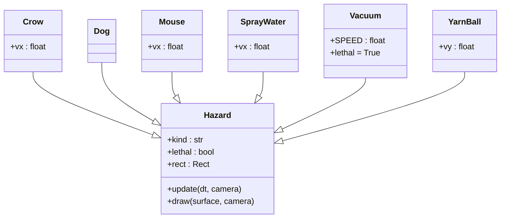
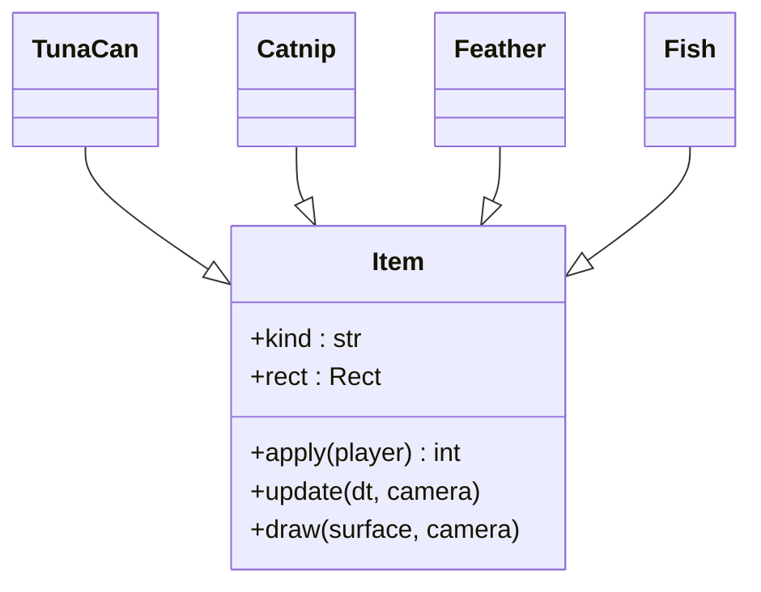
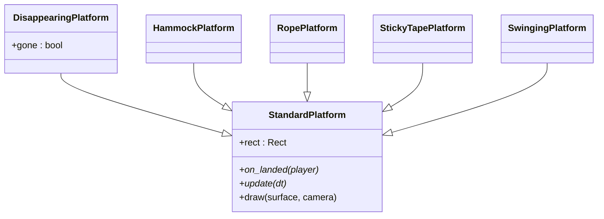
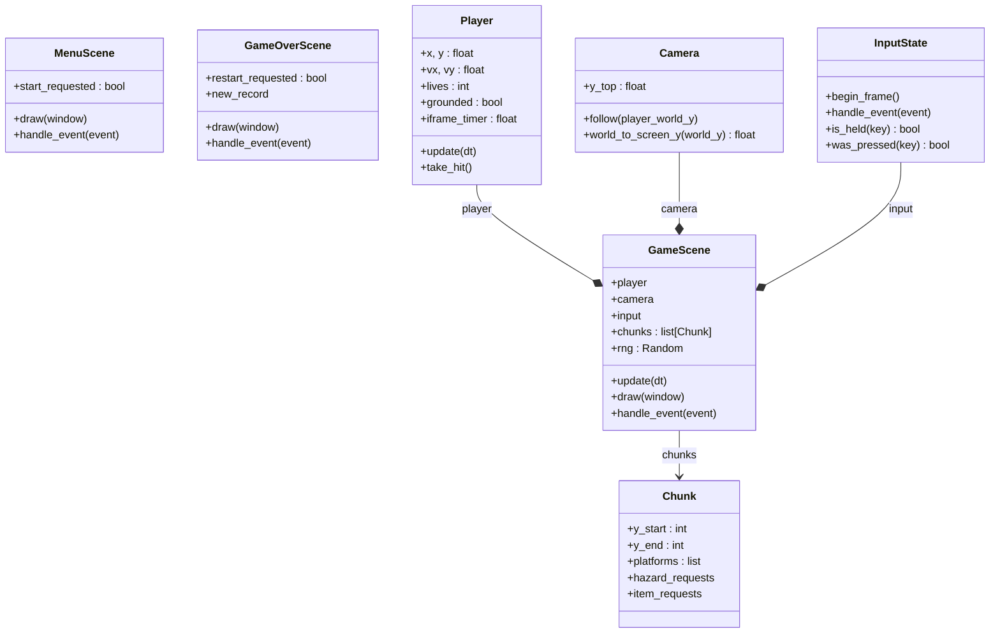
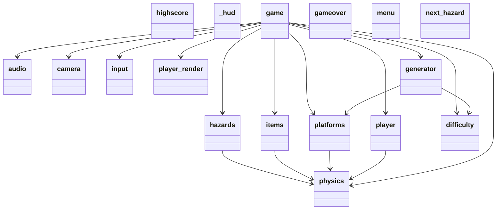

# Dongle's Adventure

Endless vertical platformer starring Dongle, a white Persian cat scaling an infinite cat tower. Inspired by MSX *Magical Tree* (Konami, 1984).

## Run

```
python -m venv .venv
.venv\Scripts\activate    # Windows
pip install -e .[dev]
python main.py
```

## Controls

- ← / → : Move
- Space : Jump (hold for higher)
- Esc   : Pause / Quit
- R     : Restart on game over

## Architecture

Layered structure with one-way dependencies (`scenes` → `entities`/`world` → `engine`). Pure-logic packages (`world/*`, `engine/physics`) have no Pygame surface dependencies and are unit-tested directly.

| Package | Role |
|---|---|
| `engine/` | Reusable Pygame plumbing — input, camera, physics, audio, highscore persistence |
| `entities/` | Game objects — Player, hazard hierarchy, item hierarchy, platform variants, sprite renderer |
| `world/` | Pure logic — procedural chunk generator, height-based difficulty curve, hazard selection |
| `scenes/` | High-level screens — menu, game, gameover; HUD overlay |

### Class diagrams

Auto-generated by `pyreverse`, split per layer for readability. Full single-diagram source: [docs/uml/classes_Dongles.mmd](docs/uml/classes_Dongles.mmd) (also [.puml](docs/uml/classes_Dongles.puml), [.svg](docs/uml/classes_Dongles.svg), [.png](docs/uml/classes_Dongles.png)).

#### Hazard hierarchy

Six hazard variants share the `Hazard` base. Lethal hazards (Vacuum) end the run; the rest cost a life.



#### Item hierarchy

Pickups give point bonuses or temporary power-ups via `apply(player)`.



#### Platform hierarchy

Five platform variants override `StandardPlatform` to customise landing behaviour and rendering.



#### Engine + scene composition

`GameScene` aggregates the player, camera, input, and procedurally generated chunks. Scenes implement a uniform handle/update/draw protocol.



<details>
<summary>Show full single-diagram class diagram (wide)</summary>



</details>

```mermaid
classDiagram
  class Camera {
    player_offset_from_top : int
    screen_height : int
    y_top : float
    follow(player_world_y) None
    is_below_screen(world_y) bool
    world_to_screen_y(world_y) float
  }
  class Catnip {
    kind : str
    apply(player) int
    draw(surface, camera) None
  }
  class Chunk {
    hazard_requests : list[tuple[str, float]]
    item_requests : list[tuple[str, float, float]]
    platforms : list
    y_end : int
    y_start : int
  }
  class Crow {
    kind : str
    vx : float
    x
    y
    draw(surface, camera) None
    update(dt, camera) None
  }
  class DifficultyParams {
    hazard_density : float
    hazard_pool : tuple[str, ...]
    platforms_per_chunk : int
    risky_platform_ratio : float
  }
  class DisappearingPlatform {
    gone : bool
    draw(surface, camera) None
    on_landed(player) None
    update(dt) None
  }
  class Dog {
    kind : str
    draw(surface, camera) None
  }
  class Feather {
    kind : str
    apply(player) int
    draw(surface, camera) None
  }
  class Fish {
    kind : str
    apply(player) int
    draw(surface, camera) None
  }
  class GameOverScene {
    altitude_m
    best_m
    new_record
    restart_requested : bool
    draw(window) None
    handle_event(event) None
  }
  class GameScene {
    camera
    chunks : list[Chunk]
    dead : bool
    hazards : list
    input
    items : list
    player
    rng : Random
    tuna_count : int
    active_powerups() list[tuple[str, float]]
    begin_frame() None
    draw(window) None
    handle_event(event) None
    update(dt) None
  }
  class HammockPlatform {
    draw(surface, camera) None
  }
  class Hazard {
    dead : bool
    h : float
    kind : str
    lethal : bool
    rect : Rect
    w : float
    x : float
    y : float
    draw(surface, camera) None
    update(dt, camera) None
  }
  class Hud {
    draw(window) None
  }
  class InputState {
    begin_frame() None
    handle_event(event) None
    is_held(key) bool
    was_pressed(key) bool
  }
  class Item {
    dead : bool
    h : int
    kind : str
    rect : Rect
    w : int
    x : float
    y : float
    apply(player) int
    draw(surface, camera) None
    update(dt, camera) None
  }
  class MenuScene {
    best_m
    start_requested : bool
    draw(window) None
    handle_event(event) None
  }
  class Mouse {
    kind : str
    vx : float
    x
    draw(surface, camera) None
    update(dt, camera) None
  }
  class Player {
    altitude_m : int
    grounded : bool
    iframe_timer : float
    invincible_timer : float
    is_alive : bool
    jump_boost_timer : float
    just_jumped : bool
    just_landed : bool
    lives : int
    rect : Rect
    vx : float
    vy : float
    x : float
    y : float
    set_input() None
    take_hit() None
    update(dt) None
  }
  class Rect {
    bottom : float
    h : float
    left : float
    right : float
    top : float
    w : float
    x : float
    y : float
  }
  class RopePlatform {
    draw(surface, camera) None
  }
  class SprayWater {
    dead : bool
    kind : str
    vx : float
    x
    draw(surface, camera) None
    update(dt, camera) None
  }
  class StandardPlatform {
    h : float
    rect : Rect
    top : float
    w : float
    x : float
    y : float
    draw(surface, camera) None
    on_landed(player)* None
    update(dt)* None
  }
  class StickyTapePlatform {
    draw(surface, camera) None
    on_landed(player) None
  }
  class SwingingPlatform {
    x
    draw(surface, camera) None
    update(dt) None
  }
  class TunaCan {
    kind : str
    apply(player) int
    draw(surface, camera) None
  }
  class Vacuum {
    SPEED : float
    kind : str
    lethal : bool
    y
    draw(surface, camera) None
    update(dt, camera) None
  }
  class YarnBall {
    kind : str
    vy : float
    y
    draw(surface, camera) None
    update(dt, camera) None
  }
  Crow --|> Hazard
  Dog --|> Hazard
  Mouse --|> Hazard
  SprayWater --|> Hazard
  Vacuum --|> Hazard
  YarnBall --|> Hazard
  Catnip --|> Item
  Feather --|> Item
  Fish --|> Item
  TunaCan --|> Item
  DisappearingPlatform --|> StandardPlatform
  HammockPlatform --|> StandardPlatform
  RopePlatform --|> StandardPlatform
  StickyTapePlatform --|> StandardPlatform
  SwingingPlatform --|> StandardPlatform
  GameScene --> Chunk : chunks
  Camera --* GameScene : camera
  InputState --* GameScene : input
  Player --* GameScene : player
```

### Module dependency graph

21 modules, 18 imports — no cycles. Source: [docs/uml/packages_Dongles.mmd](docs/uml/packages_Dongles.mmd).



### Regenerating diagrams

```powershell
pip install pylint                       # provides pyreverse
# Graphviz only needed for png/svg output:
#   winget install Graphviz.Graphviz
pyreverse -o mmd -p Dongles -d docs/uml engine entities scenes world
pyreverse -o puml -p Dongles -d docs/uml engine entities scenes world
pyreverse -o png  -p Dongles -d docs/uml engine entities scenes world   # needs Graphviz
pyreverse -o svg  -p Dongles -d docs/uml engine entities scenes world   # needs Graphviz
```

## Docs

- Spec: [docs/superpowers/specs/2026-05-03-dongles-adventure-design.md](docs/superpowers/specs/2026-05-03-dongles-adventure-design.md) ([English](docs/superpowers/specs/2026-05-03-dongles-adventure-design.en.md))
- Implementation plan: [docs/superpowers/plans/2026-05-03-dongles-adventure.md](docs/superpowers/plans/2026-05-03-dongles-adventure.md) ([한국어](docs/superpowers/plans/2026-05-03-dongles-adventure.ko.md))
